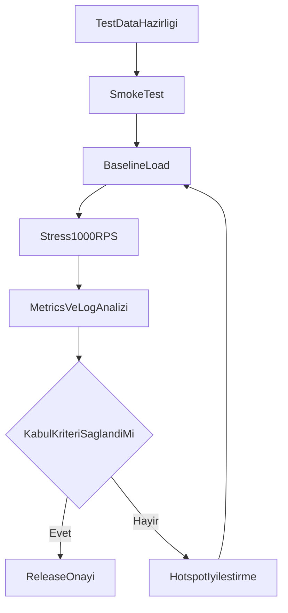

# 1000 RPS Smoke ve Stres Testi Planı

## Hedef ve Kapsam
- Amaç: `staging_like_prod` ortamında API’nin **1000 RPS** yük altında stabil çalıştığını doğrulamak ve production geçiş öncesi kritik boşlukları kapatmak.
- Araç: **k6** (seçim: script edilebilir, CI entegrasyonu kolay, threshold yönetimi güçlü).
- Kapsam: smoke test, kademeli yük/stres testi, gözlemlenebilirlik, release gate, runbook.
- Kapsam dışı (bu faz): geniş çaplı mimari refactor, yeni iş kuralı geliştirme.

## Mevcut Durumdan Alınan Girdi
- API giriş/pipeline: [c:\WorkingFolder\Azoxia\AdaIsAkademi\src\Api\Program.cs](c:\WorkingFolder\Azoxia\AdaIsAkademi\src\Api\Program.cs), [c:\WorkingFolder\Azoxia\Core\src\Api\Startup.cs](c:\WorkingFolder\Azoxia\Core\src\Api\Startup.cs)
- Route ve controller temeli: [c:\WorkingFolder\Azoxia\Core\src\Api\Controllers\ApiControllerBase.cs](c:\WorkingFolder\Azoxia\Core\src\Api\Controllers\ApiControllerBase.cs)
- Container topolojisi: [c:\WorkingFolder\Azoxia\AdaIsAkademi\docker\docker-compose.yml](c:\WorkingFolder\Azoxia\AdaIsAkademi\docker\docker-compose.yml)
- Olası hotspot örnekleri: [c:\WorkingFolder\Azoxia\AdaIsAkademi\src\Application\Commands\SystemUser\LoginSystemUserCommand.cs](c:\WorkingFolder\Azoxia\AdaIsAkademi\src\Application\Commands\SystemUser\LoginSystemUserCommand.cs), [c:\WorkingFolder\Azoxia\AdaIsAkademi\src\Application\Queries\JobPosting\ListSemanticMatchedJobPostingsQuery.cs](c:\WorkingFolder\Azoxia\AdaIsAkademi\src\Application\Queries\JobPosting\ListSemanticMatchedJobPostingsQuery.cs), [c:\WorkingFolder\Azoxia\AdaIsAkademi\src\Application\Queries\Employer\ListEmployerCommissionSummariesQuery.cs](c:\WorkingFolder\Azoxia\AdaIsAkademi\src\Application\Queries\Employer\ListEmployerCommissionSummariesQuery.cs)

## Test Stratejisi

### 1) Smoke Test (Hızlı Güvenlik Ağı)
- Her deploy sonrası 2-5 dk içinde çalışan kısa senaryo.
- Sağlık + kritik kullanıcı yolakları:
  - `GET /health`
  - `POST /SystemUsers/Login`
  - `POST /SystemUsers/RefreshToken`
  - `POST /JobPostings/ListOpen`
  - `POST /SystemUsers/Me` (token ile)
- Başarı kriteri:
  - HTTP başarısızlık oranı `< 1%`
  - p95 `< 500ms` (smoke için)
  - timeout yok, auth akışı bozulmuyor.

### 2) Baseline Load Test
- Ramp-up ile 100 -> 300 -> 600 RPS, her aşama 10-15 dk.
- Amaç: kırılma noktası öncesi latency eğrisini görmek.
- Metrikler: p50/p95/p99, error rate, saturation (CPU, RAM, DB conn, Redis hit-rate).

### 3) 1000 RPS Stres Testi
- Kademeli profil:
  - Isınma: 10 dk (200 RPS)
  - Yüklenme: 20 dk (500 -> 800 RPS)
  - Hedef plato: 30 dk (**1000 RPS sabit**)
  - Spike: 5 dk (1200-1400 RPS)
  - Soğuma: 10 dk
- Geçiş (go) kriteri:
  - 1000 RPS platosunda error rate `<= 2%`
  - p95 `<= 800ms`, p99 `<= 1500ms`
  - kritik endpointlerde 5xx artışı yok
  - DB/Redis bağlantı havuzu taşması yok
  - servis restart/oom yok.

## Production Hazırlık Kapıları
- Gözlemlenebilirlik:
  - API, DB, Redis için minimum metrik ve alarm seti (latency/error/saturation).
  - k6 çıktılarını karşılaştırmalı saklama (run-to-run trend).
- Dayanıklılık:
  - rate limiting politikası ve fail-safe davranışları.
  - Hangfire için kalıcı storage doğrulaması.
- Güvenlik/operasyon:
  - secret yönetimi (dotenv yerine güvenli store).
  - CORS daraltma ve prod konfigürasyon ayrıştırması.
- Release gate:
  - Smoke zorunlu, load/stres haftalık veya release adayı öncesi zorunlu.

## Uygulama Akış Diyagramı

## Teslimatlar
- k6 senaryo seti (smoke + load + stress) ve environment bazlı config.
- Test verisi hazırlama/checklist dokümanı.
- KPI dashboard ve alarm eşiği tanımları.
- Release gate dokümanı ve rollback koşulları.

## Önerilen İş Sırası
1. Test datasını ve auth token üretim akışını standartlaştır.
2. Smoke senaryosunu ekle ve CI’de zorunlu gate yap.
3. Baseline ve 1000 RPS stres senaryolarını çalıştır, raporla.
4. Hotspot iyileştirmelerini önceliklendir (login, semantic match, employer commission summary).
5. Production readiness maddelerini kapatıp final go/no-go kararı ver.